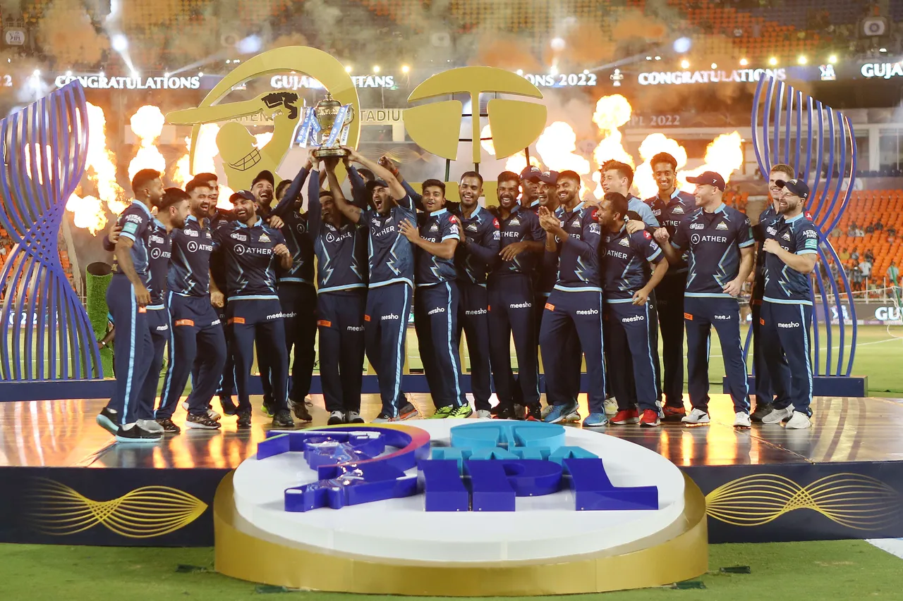

  <h2 align="center">Indian Premium League: <b>Exploratory data analysis (EDA)</b></h2>
  
A Data Analysis and Visualization Project using Python

In this project, I have done exploratory data analysis on IPL matches where I have tried to answer a few questions and find some insights using the available data. The dataset that I have used in this notebook is IPL (Indian Premier League) dataset posted on [Kaggle](https://www.kaggle.com/) Datasets sourced from [cricsheet](https://cricsheet.org/). The dataset has information about IPL matches from 2008 to 2022.

The Python packages that I have used in this notebook are:
- **NumPy**: <i>For numerical computations</i>
- **Pandas**: <i>For data processing and file input/output</i>
- **Matplotlib**: <i>For data visualization</i>
- **Seaborn**: <i>For modern and statistical visualization</i>

<h3>Analysis covered in this project:</h3>
<ol>
    <li> Number of matches played till now.</li>
    <li> Number of IPL seasons.</li>
    <li> Number of matches played in each season.</li>
    <li> Maximum and minimum matches in a season.</li>
    <li> Number of matches won by each team.</li>
    <li> Number of finals won by a team.</li>
    <li> Number of stadiums where IPL matches have been conducted.</li> 
    <li> Number of matches played in each stadium.</li>
    <li> Top 10 stadiums with maximum matches held.</li>
    <li> Inference and consequences of almost 60% matches being conducted in only 10 stadiums.</li>
    <li> Decision made after winning the toss - bat or field.</li>
    <li> Has Toss-winning helped in Match-winning?</li>
    <li> Toss decision vs win/loss analysis.</li>
    <li> Top 15 player of the match winners.</li>
    <li> Umpires who have umpired in maximum matches.</li>
</ol>

  <a href='https://github.com/kkamal11/EDA_on_IPL/blob/main/IPL_data_EDA_and_VISUALIZATION.ipynb' target='_blank'>Google Colab file</a>

